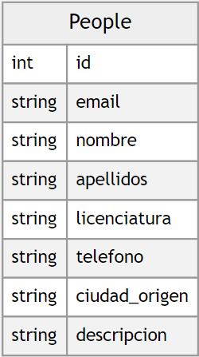
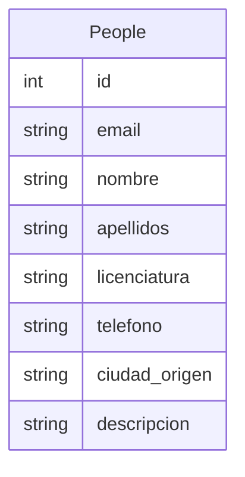

# Proyecto de Sistemas Distribuidos

## Definición

Esta será una aplicación, el cual se trata de poder conectar a varios clientes a través de diferentes medios permitiendo que la comunicación entre esto sea,
heterogénea, trasparente, concurrente, etc., esto es que varias apps puedan conectarse realizadas en varios lenguajes de programación y que la información pueda hacerse efectiva y llevarse a cabo e implementando.
Con la finalidad de tratar de hacer un sistema distribuido que funcione como mínimo de manera local, pero tratar de hacerlo que funcione de manera distribuida y de esta manera aplicaremos algunos conceptos y características de sistemas distribuidos limitándonos a lo que nuestro nivel adquisitivo lo permita.

> Sistema distribuído: es un sistema en el que los componentes hardware o software localizados en computadoras unidas mediante red, comunican y coordinan sus acciones sólo mediante paso de mensajes. George, Coulouris.

## Objetivos

 1. Hacer que la app funcione y se pueda conectar mínimo con ella misma.
 2. Hacer que otras apps puedan comunicarse con esta app y tratar de entablar una comunicación y que se puedan realizar acciones.
 3. Tratar de ejemplificar las formas necesarias para establecer comunicación con otras tecnologías, es decir, con otras apps que estén hechas en otros lenguajes de programación o con otras herramientas o tecnologías.

## Delimitaciones

 1. No se implementaran todos las características ni componentes que el concepto de sistemas distribuidos conlleva o necesita dado que no se cuenta con todo el conocimiento y las herramientas para poderlo implementar.

## Análisis de requerimientos
Para el desarrollo del proyecto necesitamos:

 1. Descargar herramientas para desarrollo del software
 2. Node JS
 3. MongoDB
 4. Express package
 5. Además establecer un protocolo de comunicación para responder a las petiociones del cliente y viceversa.
 6. Este protocolo lo estableceremos con JSON (JavaScript Object Notation) para hacer la transacción de los datos a través de la red.
 	 
## Módulos
### EndPoints

> Una **punto final de comunicación** es un tipo de nodo de red de comunicación "Nodo (informática)"). Es una interfaz expuesta por un comunicante o un canal de comunicación. Un ejemplo de punto final del último tipo sería un tema en un foro o un grupo de un sistema de comunicación.

| HTTP Method |EndPoint      |Atributos|Descripcion|
|-------------|--------------|----------|-------------------|
|`GET`        |              |          |                   |
|`POST`       |              |          |					|
|`DELETE`     |              |          |					|
|`UPDATE`     |              |          |					|

### Diagrama de la Base de datos
Esta será la base de datos para la aplicación a desarrollar, no es una gran base de datos, pero el punto principal, es entender y hacer que la aplicación distribuida funcione de manera correcta.

### APIs para conectarse a la API restful

