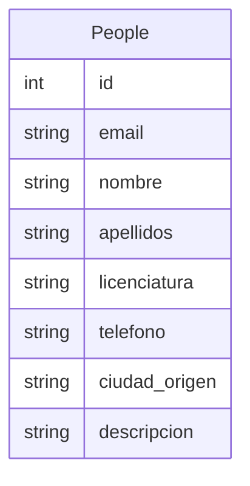

# Proyecto de Sistemas Distribuidos
## Definición
Como proyecto final de la materia de Sistemas distribuidos, realizaremos una aplicacion que nos permita aplicar la mayor cantidad de principios y características de estos para poner en práctica lo aprendido en la materia, la cual nos dara una idea fundamental de algo funcional y apegándonos a estándares y tecnologías modernas.

## Planeamiento del Problema

Desarrollar una aplicación, el cual se trata de poder conectar a varios clientes a través de diferentes medios permitiendo que la comunicación entre estos, y en el cual se apliquen principios o características de sistemas distribuidos como heterogénea, trasparente, concurrente, etc. En palabras simples, es que varias apps puedan conectarse realizadas en varios lenguajes de programación y que la información pueda hacerse efectiva y llevarse a cabo e implementando.
Con la finalidad de tratar de hacer un sistema distribuido que funcione como mínimo de manera local, pero tratar de hacerlo que funcione de manera distribuida y de esta manera aplicaremos algunos conceptos y características de sistemas distribuidos limitándonos a lo que nuestro nivel adquisitivo lo permita.

> Sistema distribuído: es un sistema en el que los componentes hardware o software localizados en computadoras unidas mediante red, comunican y coordinan sus acciones sólo mediante paso de mensajes. George, Coulouris.

## Objetivos
### Objetivo General
 1. Hacer que la app funcione y se pueda conectar mínimo con ella misma aplicando principios de sistemas distribuidos.
### Objetivos Específicos 
 1. Hacer que otras apps puedan comunicarse con esta app y tratar de entablar una comunicación y que se puedan realizar acciones.
 2. Tratar de ejemplificar las formas necesarias para establecer comunicación con otras tecnologías, es decir, con otras apps que estén hechas en otros lenguajes de programación o con otras herramientas o tecnologías.

## Delimitaciones

 1. No se implementaran todos las características ni componentes que el concepto de sistemas distribuidos conlleva o necesita dado que no se cuenta con todo el conocimiento y las herramientas para poderlo implementar.

## Análisis de requerimientos
Para el desarrollo del proyecto necesitamos:

 1. Descargar herramientas para desarrollo del software
 2. Node JS
 3. MongoDB
 4. PostMan
 5. Express package de Node
 6. Aprender lo fundamental de una API restFul para implementarla
 7. Además establecer un protocolo de comunicación para responder a las petiociones del cliente y viceversa.
 8. Este protocolo lo estableceremos con JSON (JavaScript Object Notation) para hacer la transacción de los datos a través de la red.
 	 
## Módulos

### Marco Teórico

> Según Tanenbaum (2000) se pude considerar como un sistema distribuido a una colección de computadoras independientes, que al mostrarse a los usuarios de un sistema lo hace como una única computadora, dividiéndose en dos partes, el software y el hardware. El hardware son las computadoras o máquinas autónomas que conforman el sistema y el software lo que se presenta al usuario.

La implementación de los sistemas distribuidos ya sea en empresas o diferentes instituciones ha tenido una gran ventaja a comparación de tener dispositivos aislados, ya que se permite a los usuarios tener acceso diferente información o archivos comunes.

> Según López Fuentes, Francisco (2015) los sistemas distribuidos no solo comparten información, también comparten recursos entre los usuarios, haciendo que algunas tareas se realicen de manera más rápida y en algunos casos más segura.

#### Características

Los sistemas distribuidos cumplen con características como **concurrencia**; el no tener un reloj global; Ser escalables; tolerable a fallos y fallos independientes. Cuando se habla de la **concurrencia** se refiere a la coordinación de aquellos programas que compartes recursos y estos se ejecutan de forma simultánea.

> De acuerdo a Silva (2004). La inexistencia del reloj global en los sistemas distribuidos es debido a los limites de precisión con los que las computadoras en una red pueden sincronizar sus relojes, provocando que la única comunicación se realiza enviando mensajes a través de la red. Mientras que los fallos independientes significan que cada componente pude fallar independientemente o de forma aislada, permitiendo que los demás componentes continúen con su ejecución.

Algunos aspectos importantes a tener en cuenta en el diseño de los sistemas distribuidos son la **transparencia**, **flexibilidad**, **heterogeneidad**, **escalabilidad**, **seguridad** y el **tratamiento a fallos**. Al implementar un sistema distribuido tomando es cuenta estos aspectos provoca que el sistema pueda crecer de forma proporcional, sea confiable y más velos a la hora de acceder a la información.

> De acuerdo a Cououris  (2001), la transparencia es una característica de los sistemas distribuidos para ocultar al usuario la manera en que el sistema funciona o está construido, de tal forma que el usuario tenga la sensación de que todo el sistema está trabajando en una sola máquina local.

Existen varios tipos de transparencias en los sistemas distribuidos, entre ellas esta la **transparencia de acceso** la cual permite acceder a los recursos locales y remotos empleando operaciones idénticas.

**La transparencia de ubicación**, que ayuda acceder a los recursos sin conocer su localización.

**La transparencia de coocurrencia**, este tipo de transparencia facilita que varios procesos operen concurrentemente sobre recursos compartidos sin interferencia mutua.

**La transparencia frente a fallos**, permite ocultar los fallos, dejando que los usuarios y programas de aplicación completen sus tareas a pesar de fallos de hardware o de los componentes software.

**La transparencia de movilidad**, este tipo de transparencia permite la reubicación de recursos y clientes en un sistema sin afectar la operación de los usuarios y los programas.

**La flexibilidad** facilita modificaciones al diseño inicial, lo cual permita que a la red se le puedan agregar más elementos, haciéndola mas grande, aplicando la escalabilidad.

> De acuerdo a Pino Urtubia. J & Barros Arancibia.T (2018), para que un sistema distribuido sea escalable, el sistema distribuido debe ser capaz de hacer frente al aumento del número de nodos.

**Un sistema es escalable** si conserva su efectividad cuando ocurre un incremento significativo en el número de recursos y el número de usuarios. Internet proporciona un ejemplo de un sistema distribuido en el que el número de computadores y servicios experimenta un dramático incremento.

Al escalar un sistema distribuido se debe de enfrentar a varios retos, uno de ellos son los recursos físicos, ya que la cantidad de recursos físicos debe de ser proporciona a la cantidad de usuarios en el sistema, si los usuarios aumentan, los recursos deben de aumentar también.

> Otro aspecto o elemento de un sistema distribuido debe de ser la **heterogeneidad**, la heterogeneidad, según Salguero (2018), es la variedad y diferencia que podemos encontrar en los elementos que componen una red de computadoras sobre la que se ejecuta un sistema distribuido.

**La seguridad** es el elemento más importante y más complejo principalmente debido a la existencia de conexiones y equipos físicamente distribuidos. Las técnicas de encriptación pueden ser utilizadas para proporcionar la adecuada protección a los recursos compartidos cuando se transmite mediante la red. Los ataques DOS siguen siendo un problema de seguridad. La seguridad no sólo es cuestión de ocultar los contenidos de los mensajes, también consiste en conocer con certeza la identidad del usuario u otro agente en nombre del cual se envía el mensaje.

> Según Pino Urtubia. J & Barros Arancibia.T (2018),  **la toleracia a fallos** es cunado el fallo de un nodo individual no debe afectar el logro del objetivo común del sistema distribuido.

Los fallos en los sistemas distribuido son mayores en comparación a cualquier otro sistema, pero los fallos son parciales, algunos componentes fallan mientras otros siguen funcionando.

> Según Salguero (2018), existen varias técnicas para tratarlos, estas técnicas son: detección de fallos; Enmascaramiento de fallos; Tolerancia a fallos; Redundancia.

#### Tipos de arquitecturas

En todo sistema distribuido se desea establecer una o varias comunicaciones con diferentes dispositivos, Para lograr esto, existen diferentes arquitecturas.

• Arquitectura centralizada
• Arquitectura descentralizada

##### Arquitectura centralizada

La arquitectura centralizada se basa en el modelo cliente-servidor, en este modelo los procesos se dividen en dos grupos, el cliente y el servidor. El servidor es un proceso que implementa un servicio específico (base de datos, sistema de archivos, etc). Un cliente es un proceso que solicita un servicio al servidor enviándole una petición y esperando la respuesta del servidor.

> De acuerdo a Monge. Raúl (2004). En un esquema cliente-servidor se le denomina cliente a la máquina que solicita un determinado servicio y servidor a quién lo proporciona. El servicio puede ser la ejecución de un determinado algoritmo, acceso a determinado banco de información, etc.

##### Arquitectura descentralizada

Las arquitecturas distribuidas descentralizadas se basan en la ausencia de un servidor central que proporcione un servicio o que gestione los recursos de red. En su lugar, todas las responsabilidades se dividen uniformemente entre todos los participantes o nodos (máquinas) que componen el sistema distribuido, teniendo cada nodo el rol de servidor como el de cliente.

#### Herramienta

Dentro de herramientas que existen para implementar un sistema distribuido están las APIs. La interfaz de programación de aplicaciones, abreviada como API del inglés: Application Programming Interface, es un conjunto de subrutinas, funciones y procedimientos (o métodos, en la programación orientada a objetos) que ofrece cierta biblioteca para ser utilizado por otro software como una capa de abstracción.

Las APIS utilizan diferentes tipos de protocolos o especificaciones para hacer la transferencia de datos, entre ellos están SOAP y REST, la diferencia entre estos dos es que SOAP es un protocolo, mientras que REST es un estilo de arquitectura. La arquitectura REST está compuesta por clientes, servidores y recursos, y administra las solicitudes con HTTP.

Con las APIs RESTFul podemos facilitar la escalabilidad y el acceso a los datos de una manera fácil y más eficiente para n casos y n apps. Además de promover la comunicación entre diversas tecnologías y reducir los consumos al servidor.

### Marco Conceptual
#### Sistema Distribuido
#### API
#### EndPoint
#### URL
#### Http Methods
#### GET
#### POST
#### UPDATE
#### PUTCH
#### DELETE
#### NODEJS
#### MongoDB
#### Mongoose
#### PostMan

### EndPoints

> Una **punto final de comunicación** es un tipo de nodo de red de comunicación "Nodo (informática)"). Es una interfaz expuesta por un comunicante o un canal de comunicación. Un ejemplo de punto final del último tipo sería un tema en un foro o un grupo de un sistema de comunicación.

| HTTP Method |EndPoint      |Atributos|Descripcion|
|-------------|--------------|----------|-------------------|
|`GET`        |              |          |                   |
|`POST`       |              |          |					|
|`DELETE`     |              |          |					|
|`UPDATE`     |              |          |					|

### Diagrama de la Base de datos
Esta será la base de datos para la aplicación a desarrollar, no es una gran base de datos, pero el punto principal, es entender y hacer que la aplicación distribuida funcione de manera correcta.

### APIs para conectarse a la API restful

