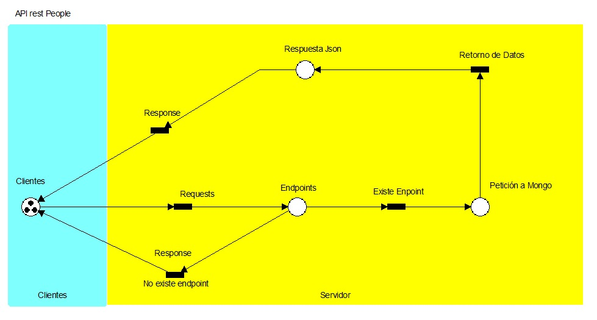
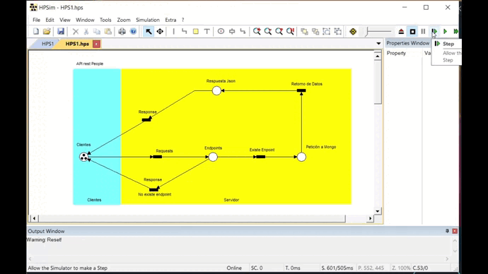

# Proyecto de Sistemas Distribuidos
## Definición
Como proyecto final de la materia de Sistemas distribuidos, realizaremos una aplicacion que nos permita aplicar la mayor cantidad de principios y características de estos para poner en práctica lo aprendido en la materia, la cual nos dara una idea fundamental de algo funcional y apegándonos a estándares y tecnologías modernas.

## Planeamiento del Problema

Desarrollar una aplicación, el cual se trata de poder conectar a varios clientes a través de diferentes medios permitiendo que la comunicación entre estos, y en el cual se apliquen principios o características de sistemas distribuidos como heterogénea, trasparente, concurrente, etc. En palabras simples, es que varias apps puedan conectarse realizadas en varios lenguajes de programación y que la información pueda hacerse efectiva y llevarse a cabo e implementando.
Con la finalidad de tratar de hacer un sistema distribuido que funcione como mínimo de manera local, pero tratar de hacerlo que funcione de manera distribuida y de esta manera aplicaremos algunos conceptos y características de sistemas distribuidos limitándonos a lo que nuestro nivel adquisitivo lo permita.

> Sistema distribuído: es un sistema en el que los componentes hardware o software localizados en computadoras unidas mediante red, comunican y coordinan sus acciones sólo mediante paso de mensajes. George, Coulouris.

## Objetivos
### Objetivo General
 1. Hacer que la app funcione y se pueda conectar mínimo con ella misma aplicando principios de sistemas distribuidos.
### Objetivos Específicos 
 1. Hacer que otras apps puedan comunicarse con esta app y tratar de entablar una comunicación y que se puedan realizar acciones.
 2. Tratar de ejemplificar las formas necesarias para establecer comunicación con otras tecnologías, es decir, con otras apps que estén hechas en otros lenguajes de programación o con otras herramientas o tecnologías.

## Delimitaciones

 1. No se implementaran todos las características ni componentes que el concepto de sistemas distribuidos conlleva o necesita dado que no se cuenta con todo el conocimiento y las herramientas para poderlo implementar.

## Análisis de requerimientos
Para el desarrollo del proyecto necesitamos:

 1. Descargar herramientas para desarrollo del software
 2. Node JS
 3. MongoDB
 4. PostMan
 5. Express package de Node
 6. Aprender lo fundamental de una API restFul para implementarla
 7. Además establecer un protocolo de comunicación para responder a las petiociones del cliente y viceversa.
 8. Este protocolo lo estableceremos con JSON (JavaScript Object Notation) para hacer la transacción de los datos a través de la red.
 	 
## Módulos

### Marco Teórico

> Según Tanenbaum (2000) se pude considerar como un sistema distribuido a una colección de computadoras independientes, que al mostrarse a los usuarios de un sistema lo hace como una única computadora, dividiéndose en dos partes, el software y el hardware. El hardware son las computadoras o máquinas autónomas que conforman el sistema y el software lo que se presenta al usuario.

La implementación de los sistemas distribuidos ya sea en empresas o diferentes instituciones ha tenido una gran ventaja a comparación de tener dispositivos aislados, ya que se permite a los usuarios tener acceso diferente información o archivos comunes.

> Según López Fuentes, Francisco (2015) los sistemas distribuidos no solo comparten información, también comparten recursos entre los usuarios, haciendo que algunas tareas se realicen de manera más rápida y en algunos casos más segura.

#### Características

Los sistemas distribuidos cumplen con características como **concurrencia**; el no tener un reloj global; Ser escalables; tolerable a fallos y fallos independientes. Cuando se habla de la **concurrencia** se refiere a la coordinación de aquellos programas que compartes recursos y estos se ejecutan de forma simultánea.

> De acuerdo a Silva (2004). La inexistencia del reloj global en los sistemas distribuidos es debido a los limites de precisión con los que las computadoras en una red pueden sincronizar sus relojes, provocando que la única comunicación se realiza enviando mensajes a través de la red. Mientras que los fallos independientes significan que cada componente pude fallar independientemente o de forma aislada, permitiendo que los demás componentes continúen con su ejecución.

Algunos aspectos importantes a tener en cuenta en el diseño de los sistemas distribuidos son la **transparencia**, **flexibilidad**, **heterogeneidad**, **escalabilidad**, **seguridad** y el **tratamiento a fallos**. Al implementar un sistema distribuido tomando es cuenta estos aspectos provoca que el sistema pueda crecer de forma proporcional, sea confiable y más velos a la hora de acceder a la información.

> De acuerdo a Cououris  (2001), la transparencia es una característica de los sistemas distribuidos para ocultar al usuario la manera en que el sistema funciona o está construido, de tal forma que el usuario tenga la sensación de que todo el sistema está trabajando en una sola máquina local.

Existen varios tipos de transparencias en los sistemas distribuidos, entre ellas esta la **transparencia de acceso** la cual permite acceder a los recursos locales y remotos empleando operaciones idénticas.

**La transparencia de ubicación**, que ayuda acceder a los recursos sin conocer su localización.

**La transparencia de coocurrencia**, este tipo de transparencia facilita que varios procesos operen concurrentemente sobre recursos compartidos sin interferencia mutua.

**La transparencia frente a fallos**, permite ocultar los fallos, dejando que los usuarios y programas de aplicación completen sus tareas a pesar de fallos de hardware o de los componentes software.

**La transparencia de movilidad**, este tipo de transparencia permite la reubicación de recursos y clientes en un sistema sin afectar la operación de los usuarios y los programas.

**La flexibilidad** facilita modificaciones al diseño inicial, lo cual permita que a la red se le puedan agregar más elementos, haciéndola mas grande, aplicando la escalabilidad.

> De acuerdo a Pino Urtubia. J & Barros Arancibia.T (2018), para que un sistema distribuido sea escalable, el sistema distribuido debe ser capaz de hacer frente al aumento del número de nodos.

**Un sistema es escalable** si conserva su efectividad cuando ocurre un incremento significativo en el número de recursos y el número de usuarios. Internet proporciona un ejemplo de un sistema distribuido en el que el número de computadores y servicios experimenta un dramático incremento.

Al escalar un sistema distribuido se debe de enfrentar a varios retos, uno de ellos son los recursos físicos, ya que la cantidad de recursos físicos debe de ser proporciona a la cantidad de usuarios en el sistema, si los usuarios aumentan, los recursos deben de aumentar también.

> Otro aspecto o elemento de un sistema distribuido debe de ser la **heterogeneidad**, la heterogeneidad, según Salguero (2018), es la variedad y diferencia que podemos encontrar en los elementos que componen una red de computadoras sobre la que se ejecuta un sistema distribuido.

**La seguridad** es el elemento más importante y más complejo principalmente debido a la existencia de conexiones y equipos físicamente distribuidos. Las técnicas de encriptación pueden ser utilizadas para proporcionar la adecuada protección a los recursos compartidos cuando se transmite mediante la red. Los ataques DOS siguen siendo un problema de seguridad. La seguridad no sólo es cuestión de ocultar los contenidos de los mensajes, también consiste en conocer con certeza la identidad del usuario u otro agente en nombre del cual se envía el mensaje.

> Según Pino Urtubia. J & Barros Arancibia.T (2018),  **la toleracia a fallos** es cunado el fallo de un nodo individual no debe afectar el logro del objetivo común del sistema distribuido.

Los fallos en los sistemas distribuido son mayores en comparación a cualquier otro sistema, pero los fallos son parciales, algunos componentes fallan mientras otros siguen funcionando.

> Según Salguero (2018), existen varias técnicas para tratarlos, estas técnicas son: detección de fallos; Enmascaramiento de fallos; Tolerancia a fallos; Redundancia.

#### Tipos de arquitecturas

En todo sistema distribuido se desea establecer una o varias comunicaciones con diferentes dispositivos, Para lograr esto, existen diferentes arquitecturas.

• Arquitectura centralizada
• Arquitectura descentralizada

##### Arquitectura centralizada

La arquitectura centralizada se basa en el modelo cliente-servidor, en este modelo los procesos se dividen en dos grupos, el cliente y el servidor. El servidor es un proceso que implementa un servicio específico (base de datos, sistema de archivos, etc). Un cliente es un proceso que solicita un servicio al servidor enviándole una petición y esperando la respuesta del servidor.

> De acuerdo a Monge. Raúl (2004). En un esquema cliente-servidor se le denomina cliente a la máquina que solicita un determinado servicio y servidor a quién lo proporciona. El servicio puede ser la ejecución de un determinado algoritmo, acceso a determinado banco de información, etc.

##### Arquitectura descentralizada

Las arquitecturas distribuidas descentralizadas se basan en la ausencia de un servidor central que proporcione un servicio o que gestione los recursos de red. En su lugar, todas las responsabilidades se dividen uniformemente entre todos los participantes o nodos (máquinas) que componen el sistema distribuido, teniendo cada nodo el rol de servidor como el de cliente.

#### Herramienta

Dentro de herramientas que existen para implementar un sistema distribuido están las APIs. La interfaz de programación de aplicaciones, abreviada como API del inglés: Application Programming Interface, es un conjunto de subrutinas, funciones y procedimientos (o métodos, en la programación orientada a objetos) que ofrece cierta biblioteca para ser utilizado por otro software como una capa de abstracción.

Las APIS utilizan diferentes tipos de protocolos o especificaciones para hacer la transferencia de datos, entre ellos están SOAP y REST, la diferencia entre estos dos es que SOAP es un protocolo, mientras que REST es un estilo de arquitectura. La arquitectura REST está compuesta por clientes, servidores y recursos, y administra las solicitudes con HTTP.

Con las APIs RESTFul podemos facilitar la escalabilidad y el acceso a los datos de una manera fácil y más eficiente para n casos y n apps. Además de promover la comunicación entre diversas tecnologías y reducir los consumos al servidor.

### Marco Conceptual
#### Sistema Distribuido
Sistema en el que los componentes hardware o software localizados en computadoras unidas mediante red, comunican y coordinan sus acciones sólo mediante paso de mensajes.

#### API
Una API es una interfaz de programación de aplicaciones (del inglés API: Application Programming Interface). Es un conjunto de rutinas que provee acceso a funciones de un determinado software.

Son publicadas por los constructores de software para permitir acceso a características de bajo nivel o propietarias, detallando solamente la forma en que cada rutina debe ser llevada a cabo y la funcionalidad que brinda, sin otorgar información acerca de cómo se lleva a cabo la tarea. Son utilizadas por los programadores para construir sus aplicaciones sin necesidad de volver a programar funciones ya hechas por otros, reutilizando código que se sabe que está probado y que funciona correctamente.

#### Web service
Un servicio web es cualquier pieza de software que se ofrece a través de Internet y estandariza su comunicación a través de la codificación XML. Un cliente invoca un servicio web enviando una solicitud (generalmente en forma de un mensaje XML), y el servicio envía una respuesta XML. Los servicios web invocan la comunicación a través de una red, con HTTP como el medio más común de conectividad entre los dos sistemas. Para muchos, los servicios web son sinónimo de SOA (Arquitectura Orientada a Servicios) y se basan principalmente en estándares como XML-RPC y SOAP (Protocolo Simple de Acceso a Objetos). Una de las principales críticas del enfoque de los servicios web es el grado en que el cliente y el servidor están acoplados entre sí.

#### REST
La transferencia de estado representacional (en inglés representational state transfer) o REST es un estilo de arquitectura software para sistemas hipermedia distribuidos como la World Wide Web. El término se originó en el año 2000, en una tesis doctoral sobre la web escrita por Roy Fielding, uno de los principales autores de la especificación del protocolo HTTP y ha pasado a ser ampliamente utilizado por la comunidad de desarrollo.

#### RESTful
RESTful es la implementación de la arquitectura propuesta sobre servicios HTTP.

#### API RESTful
Es una interface abstracta para generar comunicación a través de los servicios HTTP. En estas APIs el servidor expone información para que esta sea manipulada por el usuario. Es importante crear API RESTful según los estándares de la industria los cuales resultan en un fácil desarrollo e incremento. Implementación del servidor web que expone información que permite la manipulación de nuestra data como unidad lógica de negocio.

#### Recursos
Los recursos son URIs para acceder a la manipulación o lectura de nuestra API. Estás se usan ya que en la red para acceder a recursos se usa las URI o URL.

##### EndPoint
Un punto final de comunicación es un tipo de nodo de red de comunicación "Nodo (informática)"). Es una interfaz expuesta por un comunicante o un canal de comunicación. Un ejemplo de punto finaldel último tipo sería un tema en un foro o un grupo de un sistema de comunicación.

#### URL
Un LRU o localizador de recursos uniforme (más conocido por las siglas URL, del inglés Uniform Resource Locator)es un identificador de recursos uniforme (Uniform Resource Identifier, URI) cuyos recursos referidos pueden cambiar, esto es, la dirección puede apuntar a recursos variables en el tiempo. Están formados por una secuencia de caracteres de acuerdo con un formato modélico y estándar que designa recursos en una red como, por ejemplo, Internet.

#### Http Request
Request es una petición, cuando queremos solicitar algo a una API entonces se hace uso de un http request que es una petición que hace uso del protocolo HTTP.

#### Response
Response es una respuesta y es lo que esperamos que responda nuestra API, siempre se acompañan de un status code.

#### Http Methods
HTTP define un conjunto de métodos de petición para indicar la acción que se desea realizar para un recurso determinado. Aunque estos también pueden ser sustantivos, estos métodos de solicitud a veces son llamados HTTP verbs. Cada uno de ellos implementan una semántica diferente, pero algunas características similares son compartidas por un grupo de ellos: ej. un request method puede ser safe, idempotent (en-US), o cacheable.

##### GET
Se usa para lectura de un recurso, ya sea una colección, o bien, un solo registro de este a través de su ID.

##### POST
Se usa para la creación de un recurso algunos recomiendan poner en el header la url para ver de dónde puedo obtener el recurso creado.

##### HEAD
Es idéntico a GET, pero el servidor no devuelve el contenido en el HTTP response. Cuando se envía un HEAD request, significa que sólo se está interesado en el código de respuesta y los headers HTTP, no en el propio documento. Con este método el navegador puede comprobar si un documento se ha modificado, por razones de caching.

##### PUT
Se usa para actualizar o crear un recurso. Esta espera una actualización completa del recurso no solo de algunos campos ya que, si no se envían todos, los campos que no vayan serán nulos.

##### PATCH
El método PATCH es utilizado para aplicar modificaciones parciales a un recurso.

##### DELETE
Sirve para eliminar un recurso.

##### NODEJS
Node.js es un entorno en tiempo de ejecución multiplataforma para la capa del servidor (en el lado del servidor) basado en JavaScript.

Node.js es un entorno controlado por eventos diseñado para crear aplicaciones escalables, permitiéndote establecer y gestionar múltiples conexiones al mismo tiempo. Gracias a esta característica, no tienes que preocuparte con el bloqueo de procesos, pues no hay bloqueos.

##### MongoDB
MongoDB es una base de datos de documentos que ofrece una gran escalabilidad y flexibilidad, y un modelo de consultas e indexación avanzado.

##### Mongoose
Mongoose es una librería object-document mapping (ODM) para MongoDB. Las ventajas de utilizar un ODM son muchas y van más allá de la organización del código o del desarrollo sencillo. Mongoose abstrae todo de la base de datos, y el código de la aplicación interactúa solo con los objetos y sus métodos. Los ODM también permiten especificar las relaciones entre diferentes tipos de objectos y poner sobre esta lógica dentro de clases.

##### PostMan
PostMan es un cliente que nos ayuda a realizar las pruebas en nuestra API y con este cliente podemos probar nuestros endpoints de forma simple.

### EndPoints

> Una **punto final de comunicación** es un tipo de nodo de red de comunicación "Nodo (informática)"). Es una interfaz expuesta por un comunicante o un canal de comunicación. Un ejemplo de punto final del último tipo sería un tema en un foro o un grupo de un sistema de comunicación.
`URI Principal:`**api/v1/people/**

| HTTP Method |EndPoint      |Atributos |Descripción                   |Ejemplo  |
|-------------|--------------|----------|------------------------------|---------------------------------|
|`GET`        |      /       |          |  obtener todos los registros | **api/v1/people/**              |
|`GET`        |      /       |    id    |  obtener un registro         | **api/v1/people/5**             |
|`POST`       |      /       |          |  agregar un usuario	       | **api/v1/people/**              |
|`DELETE`     |      /       |    id    |  eliminar un usuario         | **api/v1/people/2**             |
|`UPDATE`     |      /       |    id    |  actualizar un usuario       | **api/v1/people/1**             |

### Diagrama de la Base de datos
Esta será la base de datos para la aplicación a desarrollar, no es una gran base de datos, pero el punto principal, es entender y hacer que la aplicación distribuida funcione de manera correcta.

### Red de Petri
#### Diagrama

##### No Limitada

limitación en las redes de Petri es una propiedad que indica el número de marcas que puede poseer algún marcado dentro de la red. El número de las limitaciones se determina por medio del numero de marcas,  también existe la opción de que la red solo posea una marca en los marcados, en este caso se llama una red de Petri binaria, otra posibilidad es que algún marcado este generando marcas sin ninguna limitación, en este caso es una red no limitada y es una red mal diseñada.

El diagrama llamado Api rest People es una red de Petri 3-limitadas, debido a que cualquier marcado dentro de la red puede tener tres marcas como máximo.

##### Vivacidad

Una de las propiedades de las redes de Petri es la vivacidad, esta propiedad determina si para un marcado es alcanzable desde otro, siempre y cuando su transición esta habilitada. Si todas las transiciones de una red son vivas, a la red de Petri se le llama viva.

De acuerdo al diagrama realizado, se puede observar que la red no representa bloqueos, en ninguna de sus plazas, independiente mente de la secuencia de disparo elegida, los diferentes marcados se mantienen vivos.

##### Ciclica

Una red de Petri tiene la propiedad de cilcicidad o, mejor dicho, tiene un comportamiento globalmente cíclico, si desde cualquier marcado puede llegar a la plaza inicial con una secuencia de disparos.

La red de Petri realizada posee esta propiedad, debido a que, sin importar la secuencia de disparos elegidas en los marcados, las marcas siempre regresa al inicio.

#### Emulación 

### Arquitectura del Sistema

#### Cliente-Servidor
Esta arquitectura es la que estamos más acostumbrados a utilizar en entornos distribuidos. Históricamente ha sido la más usada, y todavía lo es hoy en día. La web es un ejemplo de arquitectura cliente-servidor.

En el modelo cliente-servidor hay dos tipos de componentes:

• Clientes: hacen peticiones de servicio. Normalmente, los clientes inician la comunicación con el servidor.

• Servidores: proveen servicios. Normalmente, los servidores esperan recibir peticiones. Una vez que han recibido una petición, la resuelven y devuelven el resultado al cliente.

Un servidor también puede ser cliente de otros servidores, Los servidores web y los otros servicios disponibles en Internet son clientes del servicio de resolución de nombres (DNS). Los buscadores, permiten a los usuarios acceder a sumarios de información de páginas web extendidas por muchos sitios web de toda Internet. Un buscador es al mismo tiempo servidor y cliente: responde a peticiones provenientes de los navegadores clientes y ejecuta programas que, actuando como clientes, acceden a servidores de Internet buscando información.

### Capas y niveles

### APIs para conectarse a la API restful

